# Data model (ERD)

Status: **draft** — first version for discussion. Target database: PostgreSQL + PostGIS.

The model has four areas:

1. **Open data** — generic assets (trees and natural monuments today, anything with a location tomorrow), where they come from, reports about them from external feeds and environment readings.
2. **Users** — accounts, roles, credentials.
3. **Quests** — quests, claims, submissions, photos, review.
4. **Write-back & gamification** — attribute changes derived from approved submissions, exports to the city, points and badges.

```mermaid
erDiagram
    %% ───────────── Open data ─────────────
    DATA_SOURCE ||--o{ ASSET : provides
    DATA_SOURCE ||--o{ SYNC_RUN : "is synced by"
    SYNC_RUN ||--o{ ASSET_SNAPSHOT : records
    ASSET ||--o{ ASSET_SNAPSHOT : "has history"
    DATA_SOURCE ||--o{ ASSET_REPORT : provides
    ASSET |o--o{ ASSET_REPORT : "is reported by"
    DATA_SOURCE ||--o{ ENVIRONMENT_READING : provides
    ASSET_TYPE ||--o{ ASSET : classifies
    ASSET_TYPE ||--o{ ASSET_TYPE_TASK_TYPE : allows
    TASK_TYPE ||--o{ ASSET_TYPE_TASK_TYPE : "is allowed for"

    %% ───────────── Users ─────────────
    USER ||--o{ USER_RECOVERY_CODE : "can recover with"

    %% ───────────── Quests ─────────────
    USER ||--o{ QUEST_CAMPAIGN : creates
    QUEST_CAMPAIGN |o--o{ QUEST : groups
    ASSET ||--o{ QUEST : "is target of"
    TASK_TYPE ||--o{ QUEST : "defines task of"
    USER ||--o{ QUEST : creates
    QUEST ||--o{ CLAIM : "is claimed via"
    USER ||--o{ CLAIM : makes
    CLAIM ||--o| SUBMISSION : "results in"
    SUBMISSION ||--o{ MEDIA : contains
    USER |o--o{ SUBMISSION : reviews

    %% ───────────── Write-back ─────────────
    SUBMISSION ||--o{ ATTRIBUTE_CHANGE : proposes
    ASSET ||--o{ ATTRIBUTE_CHANGE : "is changed by"
    EXPORT_RUN |o--o{ ATTRIBUTE_CHANGE : "exports"
    DATA_SOURCE ||--o{ EXPORT_RUN : "receives"
    USER ||--o{ EXPORT_RUN : triggers

    %% ───────────── Gamification ─────────────
    USER ||--o{ POINT_TRANSACTION : earns
    SUBMISSION |o--o{ POINT_TRANSACTION : "rewards"
    USER ||--o{ USER_BADGE : holds
    BADGE ||--o{ USER_BADGE : "is awarded as"

    DATA_SOURCE {
        uuid id PK
        varchar key UK "e.g. de-muenster-trees"
        varchar adapter_key "adapter implementation, e.g. de-muenster"
        varchar name
        varchar city
        varchar source_url
        varchar license "e.g. dl-de/by-2.0"
        text attribution "shown in the app"
        jsonb config "adapter-specific settings"
        boolean is_active
        timestamptz created_at
    }

    SYNC_RUN {
        uuid id PK
        uuid data_source_id FK
        timestamptz started_at "= fetched_at of the snapshot"
        timestamptz finished_at
        varchar status "running | succeeded | failed"
        varchar snapshot_key "raw download (or manifest incl. reference data)"
        varchar schema_hash "source fields; a change fails the run"
        int record_count "records in the download"
        int assets_created
        int assets_updated
        int assets_removed
        text error
    }

    ASSET_SNAPSHOT {
        uuid id PK
        uuid asset_id FK "UK with sync_run_id"
        uuid sync_run_id FK
        varchar change_type "created | updated | removed"
        geography geom "position in this version"
        jsonb raw "source record in this version"
        varchar source_hash
    }

    ASSET_REPORT {
        uuid id PK
        uuid data_source_id FK
        varchar external_id "UK with data_source_id"
        varchar category "tree_damage | oak_processionary_moth | ..."
        varchar status "open | closed"
        text description "citizen text, contact details removed"
        text status_notes "answer of the city"
        text address
        text media_url
        geography geom "reported position"
        uuid asset_id FK "nearest asset within 25 m, nullable"
        float distance_m
        timestamptz reported_at
        timestamptz source_updated_at
        jsonb raw
        varchar source_hash
        timestamptz first_seen_at
        timestamptz last_seen_at
    }

    ENVIRONMENT_READING {
        uuid id PK
        uuid data_source_id FK
        varchar station_id "UK with source, metric, measured_at"
        varchar metric "e.g. soil_moisture_grass_sand_0_60cm"
        float value
        varchar unit "%nFK | mm | °C"
        timestamptz measured_at "start of the day / period"
        geography geom "station, nullable"
        timestamptz imported_at
    }

    ASSET_TYPE {
        uuid id PK
        varchar key UK "tree | natural_monument | ..."
        varchar name "i18n key"
        varchar icon
        jsonb attribute_schema "JSON Schema of ASSET.attributes"
    }

    ASSET {
        uuid id PK
        uuid asset_type_id FK
        uuid data_source_id FK
        varchar external_id "UK with data_source_id; own id if the source has none"
        geography geom "PostGIS, WGS84 (4326)"
        jsonb attributes "normalized, validated by attribute_schema"
        jsonb raw "original source record"
        varchar source_hash "detects changes on sync"
        varchar status "active | removed_at_source"
        timestamptz first_seen_at
        timestamptz last_seen_at
        timestamptz updated_at
    }

    TASK_TYPE {
        uuid id PK
        varchar key UK "photo | verify_attribute | measure | condition_report"
        varchar name "i18n key"
        jsonb config_schema "JSON Schema of QUEST.task_config"
        jsonb result_schema "JSON Schema of SUBMISSION.payload"
    }

    ASSET_TYPE_TASK_TYPE {
        uuid asset_type_id PK, FK
        uuid task_type_id PK, FK
    }

    USER {
        uuid id PK
        varchar username UK
        varchar password_hash "argon2id, never plain text"
        varchar role "player | moderator | admin"
        varchar display_name
        varchar locale "e.g. de"
        int total_points "cache of POINT_TRANSACTION sum"
        timestamptz last_login_at
        timestamptz created_at
        timestamptz deleted_at "soft delete / GDPR anonymization"
    }

    USER_RECOVERY_CODE {
        uuid id PK
        uuid user_id FK
        varchar code_hash "argon2id, code shown once at sign-up"
        timestamptz used_at "null = still valid, single use"
        timestamptz created_at
    }

    QUEST_CAMPAIGN {
        uuid id PK
        uuid created_by FK
        varchar title
        text description
        jsonb asset_filter "filter used to generate the quests"
        timestamptz created_at
    }

    QUEST {
        uuid id PK
        uuid campaign_id FK "nullable"
        uuid asset_id FK
        uuid task_type_id FK
        uuid created_by FK
        varchar title
        text description
        jsonb task_config "e.g. which attribute to verify"
        int max_completions "X: how often the quest can be done"
        int slots_taken "active claims + pending/approved submissions"
        int reward_points
        int geofence_radius_m "e.g. 30"
        int claim_ttl_minutes "claim expires after this"
        varchar status "draft | active | paused | full | closed"
        timestamptz starts_at
        timestamptz ends_at
        timestamptz created_at
    }

    CLAIM {
        uuid id PK
        uuid quest_id FK
        uuid user_id FK
        varchar status "active | submitted | expired | cancelled"
        timestamptz claimed_at
        timestamptz expires_at
        timestamptz closed_at
    }

    SUBMISSION {
        uuid id PK
        uuid claim_id FK, UK
        jsonb payload "task result, validated by result_schema"
        geography location "player position at submit time"
        float distance_m "distance to asset, geofence check"
        varchar status "pending | approved | rejected"
        uuid reviewed_by FK "nullable"
        timestamptz reviewed_at
        text rejection_reason
        timestamptz submitted_at
    }

    MEDIA {
        uuid id PK
        uuid submission_id FK
        varchar storage_key "object key in S3 / MinIO"
        varchar mime_type
        int width
        int height
        int size_bytes
        varchar sha256 "exact duplicate detection"
        varchar phash "perceptual hash, near-duplicate detection"
        timestamptz captured_at "from EXIF, before EXIF is stripped"
        timestamptz created_at
    }

    ATTRIBUTE_CHANGE {
        uuid id PK
        uuid submission_id FK
        uuid asset_id FK
        varchar attribute_key "e.g. genus, photo_url, condition"
        jsonb old_value
        jsonb new_value
        varchar status "proposed | accepted | exported | discarded"
        uuid export_run_id FK "nullable"
        timestamptz created_at
    }

    EXPORT_RUN {
        uuid id PK
        uuid data_source_id FK
        uuid created_by FK
        varchar format "csv | geojson | api"
        varchar storage_key "exported file"
        varchar status "running | succeeded | failed"
        int change_count
        timestamptz created_at
    }

    POINT_TRANSACTION {
        uuid id PK
        uuid user_id FK
        uuid submission_id FK "nullable"
        int amount "may be negative"
        varchar reason "quest_approved | badge | correction | ..."
        timestamptz created_at
    }

    BADGE {
        uuid id PK
        varchar key UK
        varchar name "i18n key"
        varchar icon
        jsonb criteria
    }

    USER_BADGE {
        uuid user_id PK, FK
        uuid badge_id PK, FK
        timestamptz awarded_at
    }
```



## Design decisions

### Generic assets instead of a `tree` table

Trees are not modeled as their own table. Every open data object is an **`ASSET`** with a **`ASSET_TYPE`** (`tree`, later `bench`, `playground`, `bike_rack`, …):

- Common fields every object has — location, source, external id, sync state — are real columns.
- Type-specific fields live in `ASSET.attributes` (JSONB) and are validated against `ASSET_TYPE.attribute_schema` (JSON Schema). A new asset type needs **no migration**, only a new `ASSET_TYPE` row and adapter support.
- `ASSET.raw` keeps the untouched source record, so we can re-normalize later without re-downloading.
- `geom` is a PostGIS `geography`. Points today; polygons or lines (e.g. green areas, paths) fit the same column later.
- Frequently filtered attributes can get expression / GIN indexes, e.g. `(attributes->>'genus')`.

Alternative considered: one table per asset type (`tree`, `bench`, …). Rejected because every new data set would need schema changes in core, which contradicts the adapter idea.

### Snapshots and history

Every import is a `SYNC_RUN` (it is the snapshot in the sense of [ADR-0001](../adr/0001-baumkataster-datenbezug-und-rueckkanal.md): `snapshot_id` = `SYNC_RUN.id`, `fetched_at` = `SYNC_RUN.started_at`). History is kept on two levels:

- **Full download:** the unchanged file from the source is stored in object storage (`SYNC_RUN.snapshot_key`). Every snapshot can be reloaded exactly as it was. Keys are content hashes, so identical downloads share one file. If the adapter needs reference data to parse the source (Münster: street list and district polygons), those files are stored too and `snapshot_key` points to a small manifest listing all files.
- **Changes per asset:** `ASSET_SNAPSHOT` gets a row only when an asset was created, changed (`source_hash` differs) or disappeared at the source. A daily sync of 43k unchanged trees therefore adds no rows, and the state of any asset at any sync can still be reconstructed.

`ASSET` itself always holds the current state. `SYNC_RUN.schema_hash` records the source's field list; if it changes unexpectedly, the run fails loudly instead of importing broken data.

### Asset identity

`ASSET.id` is our own id and never changes. Sources with stable ids of their own store them in `external_id` and are matched by it; sources without (Münster) are matched spatially. Each adapter declares its strategy. Details and reasoning: [ADR-0006](../adr/0006-eigene-asset-id-und-raeumliches-matching.md).

### Reports and environment readings

Not everything from open data is an asset. Two further kinds of records come from external feeds and are written by the importer (API: read only, EF migration `AddReportsAndReadings`):

- **`ASSET_REPORT`**: a report about the real world, e.g. a citizen reporting a broken branch in the city's issue tracker ("Mängelmelder", Open311). Reports are matched by `external_id`, keep their status history in `raw`/`source_hash`, and are linked to the nearest active asset of the adapter's asset types within 25 m (`asset_id`, `distance_m`; re-linked on every sync because assets come and go). The feed only shows the last 90 days; older reports keep their last known status. Admins create quests from them with `target.withOpenReport` (a category or `any`), e.g. a `condition_report` quest for every tree with an open damage report.
- **`ENVIRONMENT_READING`**: a value of a metric at a station and time, e.g. the DWD's daily modelled soil moisture. Matched by station, metric and time; values are updated if the source revises them. Intended trigger for "water this tree" quests.

For these runs, `SYNC_RUN.assets_created/updated` count reports or readings.

### Enrichers

Data that is keyed by location rather than by the source (e.g. heights from a state-wide surface model) is added by **enrichers**. They run after the adapter, are configured per data source and set attributes that must exist in the asset type's schema. What an enricher used is stored in the sync's snapshot (`SYNC_RUN.snapshot_key`), so the result stays reproducible. No extra tables: the values live in `ASSET.attributes` like everything else.

### Where city-specific things live

`DATA_SOURCE` describes one concrete data set of one city and points to the adapter that reads it (`adapter_key`) plus adapter-specific `config`. Core code never branches on city names — see [CLAUDE.md](../../CLAUDE.md).

### One quest = one asset

A quest targets exactly one asset. When an admin creates quests "for all trees in district X", a **`QUEST_CAMPAIGN`** is created and one `QUEST` per matching asset is generated. This keeps `max_completions` unambiguous (per asset) and makes the map simple (one marker per quest).

### Limiting completions (`max_completions`)

- `QUEST.slots_taken` counts active claims plus pending/approved submissions.
- Claiming happens in one transaction: `SELECT … FROM quest WHERE id = $1 FOR UPDATE`, check `slots_taken < max_completions`, insert `CLAIM`, increment `slots_taken`. This prevents two players from taking the last slot at the same time.
- A claim that expires (`expires_at`) or a rejected submission decrements `slots_taken`.
- Constraint: at most one `active` claim per user and quest (partial unique index on `CLAIM(quest_id, user_id) WHERE status = 'active'`).

### Users & passwords

- Only `password_hash` is stored (argon2id). Plain passwords never touch the database or logs.
- **No email address is stored.** Players sign up with username + password only, which keeps the barrier low and avoids personal data. Consequence: there is no password reset via email. Instead, accounts are recovered with **one-time recovery codes** (`USER_RECOVERY_CODE`):
  - At sign-up the player is shown a set of codes once (e.g. 8) and asked to save them. Only their argon2id hashes are stored.
  - With a valid code the player can set a new password. The code is then marked `used_at` and can't be used again.
  - Players can regenerate their codes while logged in; this deletes the old ones.
  - Login and recovery attempts are rate-limited, since codes are the only recovery path.
- `deleted_at` allows GDPR deletion by anonymizing the row while keeping submissions (and the open data they produced) intact.
- Sessions / refresh tokens are left to the auth library we pick and are not modeled here yet.

### From submission to open data

An approved `SUBMISSION` produces `ATTRIBUTE_CHANGE` rows (e.g. `genus: "Baum Amt62" → "Tilia"`, `photo_url: null → …`). We never overwrite `ASSET.attributes` from the city directly with player data — changes are collected and exported via `EXPORT_RUN`, because the city stays the owner of the data. The next sync then brings the city's (possibly updated) values back.

### Points as a ledger

`POINT_TRANSACTION` is append-only; `USER.total_points` is only a cache for fast leaderboards. This makes corrections traceable (e.g. negative amount after a submission is rejected later).

## Münster tree data (`gruen_opendata.csv`)

All sources, licenses and attribution: [data-sources.md](data-sources.md). Source and access are decided in [ADR-0001](../adr/0001-baumkataster-datenbezug-und-rueckkanal.md): the data comes live from the city's WFS (`geo.stadt-muenster.de/mapserv/odgruen_serv`, layer `Baeume`), not from the portal. License dl-de/by-2.0.

Analysis of the CSV export (43,114 rows):

| Column | Example | Meaning | Mapping |
|---|---|---|---|
| `WKT` | `POINT (7.6123466 51.9746341)` | Location, WKT, lon/lat WGS84 | `ASSET.geom` |
| `str_schl` | `02505` | Street key (Straßenschlüssel), 1,067 distinct values, 14 empty | `attributes.street_key` (keep as string, leading zeros!) |
| `baumgruppe` | `Tilia` | Genus (Latin), 74 distinct values | `attributes.genus` |

Findings that affect the model:

- **No id column.** Decided in [ADR-0006](../adr/0006-eigene-asset-id-und-raeumliches-matching.md): we assign our own id (`ASSET.id`) and store it in `external_id` as well (required and unique per source in the API's schema; exports reference assets by it). On re-sync, records are matched to existing assets by identical record first, then by nearest position within 1 m. **Question for Stadt Münster:** is there an internal tree number we could get in the export? With it, the adapter would switch to matching by `external_id`.
- **Only the genus, not the species.** Top genera: Tilia 10,279 · Quercus 8,199 · Acer 5,324 · Carpinus 3,448.
- **Unknown / placeholder genus:** 2,832 × `Baum Amt62` and 103 empty values. The adapter normalizes these to `genus = null` (raw value stays in `raw`). These ~2,900 trees are ideal targets for first `verify_attribute` quests.
- **Enrichment** (done in the adapter, reference files are part of the snapshot):
  - `street_name`: `str_schl` joined to the street directory WFS `odstrasseserv` (layer `ms:Strassen`). 42,878 of 43,114 trees (99.45 %) get a name; the rest have no key (14) or a key missing from the directory (mostly `00713`: 124, `06995`: 57).
  - `district`: point in polygon against the 6 Stadtbezirke from the portal (`stadtbezirke-muenster.geojson`, field `NAME_STADT`). All trees get a district; the result matches PostGIS `ST_Contains` for every tree.
  - `quarter`: point in polygon against the 45 Stadtteile (statistical districts, `stadtteile-statistische-bezirke-muenster.geojson`, field `NAME_STATI`).
  - `height_m`: object height above ground from the **nDOM50 surface model of Geobasis NRW** (WCS, 0.5 m grid, dl-de/zero-2.0), 95th percentile within 2.5 m of the tree point; same method as `packages/adapters/de-nrw` in PR #7. Added by the enricher `de_nrw.ndom_height`, which is not tied to Münster and can be switched on for any data source in NRW. It is the height *at the inventory point*, not a measured tree height: trees next to buildings can pick up the building, values below 2 m usually mean a young, pruned or missing tree.
- The ADR also flags near-duplicates (< 1 m apart) and data quality issues. These go into `attributes.quality_flags`.

`attribute_schema` for `ASSET_TYPE = tree` (defined in `AssetType.Tree`, `packages/core/OpenQuest.Core/Domain/AssetType.cs`, seeded by the API; abridged):

```json
{
  "type": "object",
  "properties": {
    "genus":        { "type": ["string", "null"], "description": "Latin genus, e.g. Tilia" },
    "genus_raw":    { "type": ["string", "null"], "description": "Genus exactly as delivered by the source" },
    "species":      { "type": ["string", "null"], "description": "Latin species, not in Münster data yet" },
    "street_key":   { "type": ["string", "null"], "description": "5 digits, zero-padded" },
    "street_name":  { "type": ["string", "null"] },
    "district":     { "type": ["string", "null"], "description": "Stadtbezirk" },
    "quarter":      { "type": ["string", "null"], "description": "Stadtteil (statistical district)" },
    "height_m":     { "type": ["number", "null"], "description": "Object height above ground at the tree point (nDOM); not a measured tree height" },
    "avenue_id":    { "type": ["string", "null"], "description": "Protected avenue (Alleenkataster NRW), e.g. AL-MS-9004" },
    "avenue_name":  { "type": ["string", "null"] },
    "quality_flags": { "type": "array", "items": { "enum": ["placeholder_genus", "near_duplicate", "typo_corrected", "ambiguous_genus"] } },
    "trunk_circumference_cm": { "type": ["number", "null"] },
    "condition":    { "enum": ["good", "damaged", "dead", "gone", null] },
    "photo_url":    { "type": ["string", "null"] },
    "vitality":     { "enum": ["healthy", "slightly_damaged", "clearly_damaged", "severely_damaged_or_dead", null], "description": "Roloff-like scale, from player photos" },
    "damage":       { "type": "array", "items": { "enum": ["bark_wound", "cavity", "crack", "leaning", "broken_branch", "dead_branches", "root_damage"] } },
    "pests":        { "type": "array", "items": { "enum": ["oak_processionary_nests", "leaf_miner_damage", "mistletoe", "other_pest"] } },
    "age_class":    { "enum": ["young", "semi_mature", "mature", "veteran", null] },
    "tree_pit": {
      "type": ["object", "null"],
      "properties": {
        "surface": { "enum": ["open_soil", "planted", "mulched", "sealed", "grate"] },
        "watering_bag": { "type": "boolean" },
        "stakes": { "type": "boolean" },
        "protection_guard": { "type": "boolean" }
      }
    }
  }
}
```

### Attributes vs. observations from player photos

`@openquest/tree-verification` returns `proposedChanges` for every photo (see [ADR-0005](../adr/0005-tree-assessment-from-player-photos.md)):

- `kind: "attribute"` (condition, vitality, damage, pests, age_class, tree_pit, genus): the **state** of the tree. Becomes an `ATTRIBUTE_CHANGE` with `status = proposed`.
- `kind: "observation"` (phenology, drought_stress, tree_pit_issue, safety_concern): **time stamped facts** that must not overwrite each other, e.g. "flowering on 2026-05-03". They form a history per asset (useful for phenology time series) and fit `ATTRIBUTE_CHANGE` rows with `attribute_key = "observation:<key>"` for now; a dedicated `ASSET_OBSERVATION` table in the API is the cleaner option.
- `kind: "new_asset"`: a photographed tree with no inventory tree nearby; a candidate for a new `ASSET` after review.

`requiresReview = true` (always for hazards, dead or missing trees, new assets) means a moderator has to confirm before the change may be accepted or exported to the city.

The assessment attributes above (`vitality`, `damage`, `pests`, `age_class`, `tree_pit`) are not yet part of the tree schema in `AssetType.Known` (`packages/core/OpenQuest.Core/Domain/AssetType.cs`); they have to be added there before the API accepts them.

`ambiguous_genus`: the source names the tree by a common name that stands for several genera ("Kastanie", "Obstbaum", "Mammutbaum") or by one we can't map yet.

`attribute_schema` for `ASSET_TYPE = natural_monument` (abridged): `monument_number`, `description` (e.g. "1 Platane"), `genus` (if one genus), official `height_m`, `circumference_m`, `crown_diameter_m` (the largest value for groups), `location`, `historical_context`, `landscape_context`, `condition`, `photo_url`, `avenue_id`, `avenue_name`, `quality_flags`. Allowed tasks: photo, measure, condition report.

## Other data sources

| Source | Adapter / enricher | Writes | Licence |
|---|---|---|---|
| Straßen.NRW "Fachschale Baum": trees along federal and state roads, all of NRW, clipped to Münster (2,314 trees) | `de_nrw.strassen_trees` | `ASSET` (`tree`), German names mapped to genera | dl-de/zero-2.0 |
| Naturdenkmale Münster (WMS `naturschutz_serv`, layer `naturschutz2`) | `de_muenster.natural_monuments` | `ASSET` (`natural_monument`), matched by register number | **not stated**, source disabled until the city agrees |
| Mängelmelder Münster (Open311, Beteiligung NRW), services "Baum" and "Eichenprozessionsspinner" | `open311.reports` | `ASSET_REPORT` | dl-de/by-2.0 |
| DWD daily soil moisture, station 1766 Münster/Osnabrück (AMBAV) | `dwd.soil_daily` | `ENVIRONMENT_READING` | GeoNutzV ("Quelle: Deutscher Wetterdienst") |
| Alleenkataster NRW (LINFOS WFS) | enricher `de_nrw.alleen` | `avenue_id`, `avenue_name` | dl-de/zero-2.0 |
| Any polygon GeoJSON (e.g. Stadtbezirke) | enricher `geo.area_name` | a configured attribute | as the source |

## Implementation notes (backend, .NET)

Where the running backend differs from or adds to the draft above. Tables use singular snake_case names (`asset`, `claim`, `user`, …); enums are stored as snake_case strings.

- **Points:** `POINT_TRANSACTION` is implemented as in the ERD (append-only, unique per `submission_id` and `reason`, `amount <> 0`). Reasons so far: `quest_approved` (the quest's `reward_points`, paid when a submission is approved) and `correction`. `USER.total_points` is updated in the same transaction as the ledger line. Levels are not stored: they are computed from `total_points` with a curve (`LevelCurve`, default thresholds 0/100/250/500/800, override with `Gamification:LevelThresholds`).
- **Cities and districts (not in the ERD diagram above, [ADR-0007](../adr/0007-cities-and-districts-drawn-by-admins.md)):** `city` (`key`, `name`, `country_code`, `center_lat/lon`, `default_zoom`, `timezone`, `is_active`), `district` (`city_id`, `key`, `name`, `description`, `color`, `is_active`, `total_points` cache, derived `geom` polygon and `centroid_lat/lon`; `key` and `name` unique per city) and `district_point` (`district_id`, `position`, `lat`, `lon`; unique per district and position). The ordered points are the source of the outline. `POINT_TRANSACTION.district_id` records the district a point was earned in at the time of the award (set null when the district is deleted, which is only possible while no points exist).
- **Cards ([ADR-0009](../adr/0009-tree-cards-and-rarity.md)):** `card` (one per approved submission, unique on `submission_id`: `user_id`, `asset_id`, `district_id` at that time, `genus`, `rarity` = `common | uncommon | rare | legendary`, `frequency` = `abundant | common | scarce | very_scarce` of the genus in the district, `share`, `reasons` as JSON array, `created_at`) and `district_genus_stat` (`district_id`, `genus`, `tree_count`; primary key on both), which `district` summarizes with `known_genus_trees` and `genus_stats_at`. The statistics are counted from the assets inside the district's outline and recalculated when missing, after the district changed, or when old.
- **Recurring quests ([ADR-0010](../adr/0010-recurring-quests-and-sync-events.md)):** `asset_activity` (`asset_id` primary key, `last_verified_at`, `verification_count`; derived from the approved submissions by a handler, no row = never verified), `quest_schedule` (`name` unique, `city_id`, `is_enabled`, `weekday` 0-6 with 0 = Sunday, `time_of_day` in the city's time zone, `duration_hours`, `task_type`, `title`, `description`, `task_config`, `target` = the `QuestTarget` as JSON, `max_completions`, `reward_points` = the bonus, `geofence_radius_m`, `claim_ttl_minutes`, `created_by`) and `quest_schedule_run` (primary key `schedule_id` + `period_key`, e.g. `2026-W39` or `manual:…`; `ran_at`, `campaign_id`, `quests_created`, `error`). The primary key of the run table is what makes a run happen only once per week.
- **New trees and problems ([ADR-0011](../adr/0011-new-tree-reports-and-automatic-review.md)):** `quest.asset_id` is nullable and `quest.district_id` was added (check: one of them is set); a quest of task type `report_new_tree` belongs to a district. `asset_proposal` (one per submission, unique on `submission_id`: `data_source_id`, `asset_type_id`, `district_id`, `geom` point, `genus`, `species`, `note`, `photo_url`, `status` = `proposed | accepted | exported | discarded` like `attribute_change`, `export_run_id`) holds a tree a player reported as missing; approved proposals are published as attribute `new_tree` next to the other accepted changes. `condition_report` may carry `issues` (array of codes, see `TaskTypes.IssueCodes`) which is proposed as a second `attribute_change` on the attribute `issues`. `submission.auto_review` (JSON: verdict, reasons, details) and `auto_reviewed_at` record the automatic check; `reviewed_by` is empty when it approved.
- **Sync events:** the importer sends `pg_notify('sync_finished', <sync_run id>)` when a run is committed; the API turns it into an `AssetSyncCompleted` event in the outbox.
- **Not implemented yet:** `BADGE`, `USER_BADGE`. `MEDIA.captured_at` stays null (the EXIF time is dropped with the rest of the metadata).
- **Import is not part of the API.** Assets, data sources and sync runs are written by the separate importer; the API only reads them (and reads `sync_run` / `asset_snapshot` for `GET /admin/sync/runs` and `GET /admin/assets/{id}/history`). How `external_id` is assigned (or left empty for sources without ids) and how assets are matched across syncs is decided by the importer.
- **`quality_flags` of trees** use exactly the enum above: `placeholder_genus` (`Baum Amt62`, `Baumgruppe`, `Standort`, `Leerer*`, `Unbekannt`, empty), `typo_corrected` (a known typo such as `Catalpha` was fixed, or a `-Hybride` suffix was stripped), `near_duplicate` (another tree < 1 m away). Quests can select assets with a JSONB containment filter on these, e.g. `{"genus": null}`. The `condition` enum is `good | damaged | dead | gone`, used by the `condition_report` task.
- **Claims:** the partial unique index covers `status IN ('active','submitted')` (not only `active`), so a player cannot claim a quest again after handing in a submission. A rejected submission sets the claim to `cancelled`, which frees the slot and allows a retry. `quest.status = 'full'` is derived from `slots_taken` and set automatically.
- **Task types:** `task_config` / `payload` are validated with the JSON Schemas in `task_type` (`verify_attribute` and `measure` need `{"attribute": "<key>"}` in `task_config`, the key must exist in the asset type's `attribute_schema`). Each task type maps to the attribute it changes: `photo` → `photo_url` (`/media/{id}`), `condition_report` → `condition`, the other two → `task_config.attribute`.
- **Attribute changes:** created as `proposed` on submit, `accepted` on approval, `discarded` on rejection, `exported` by an export run.
- **`MEDIA.phash`** is 16 hex characters (64-bit difference hash).
- **Recovery codes:** 8 codes of 12 characters (`XXXX-XXXX-XXXX`, ambiguous characters left out), matched case- and separator-insensitively.
- **Outbox:** table `outbox_message` (`type`, `payload` jsonb, `occurred_at`, `available_at`, `processed_at`, `attempts`, `last_error`, `status` = `pending | processed | dead`) holds domain events written in the same transaction as the change they describe; a trigger sends `NOTIFY outbox`. See [ADR-0004](../adr/0004-event-driven-writeback.md).
- **Open data and user data ([ADR-0014](../adr/0014-open-data-is-read-only-and-data-origin.md)):** `asset.attributes` is only what the city delivered. Everything players contribute is a separate layer: `attribute_change` (status `accepted` = approved and kept in our database, `exported` = also sent to open data) and `asset_proposal` for trees that are not in the data. Publishing is off by default (`Publishing:Enabled`), so `accepted` is the normal end state. The API tells the origin per attribute (`GET /assets/{id}`: `origin` = `open_data` | `user`).
- **`EXPORT_RUN`** is now created by the event handler (only while publishing is on) for every delivered batch of accepted changes, so `created_by` is nullable (null = triggered by the system). `storage_key` holds the location of the published resource (public feed path or GitHub URL).
- **Snapshots and history:** written by the importer as described in "Snapshots and history". The API shows them read-only: `GET /admin/sync/runs` lists the runs (status, counters, error), `GET /admin/assets/{id}/history` the versions of an asset (`created`, `updated`, `removed`).
