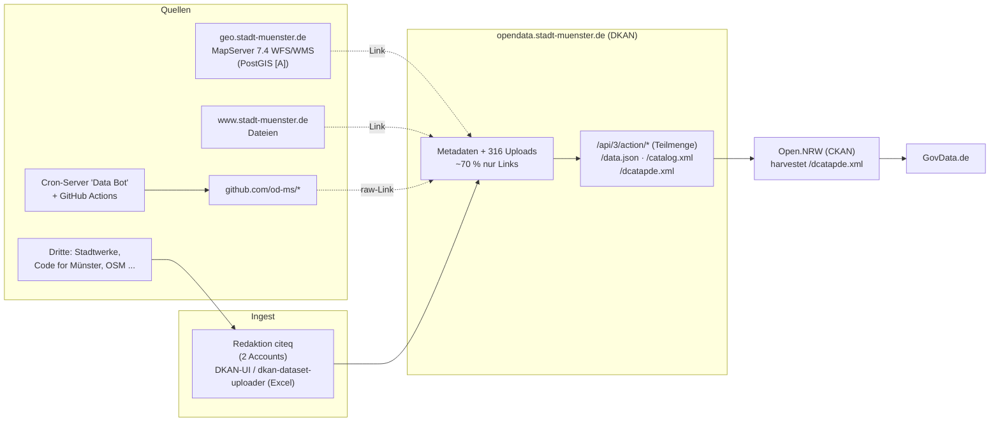

# Research Note 0001: Open-Data-Portal Münster und Baumkataster, Datenbezug und Rückkanal

| Feld | Wert |
|---|---|
| Status | Vorgeschlagen |
| Datum | 2026-09-25 |
| Autor | susishopware (SRE) |
| Kontext | Hackathon (vermutlich MÜNSTERHACK 2026, #MSHACK26, 25. und 26.09.2026) |
| Betrifft | Team Karte/Datenbank, Team Analyse, alle, die Daten zurückspielen wollen |

Legende: **[V]** = am 25.09.2026 selbst per curl/API geprüft, **[Q]** = aus Quelle übernommen, **[A]** = Annahme/Einschätzung.

## 1. Fragestellung

1. Welche Daten bekommen wir zum Baumkataster, in welcher Form und Qualität?
2. Wie ist opendata.stadt-muenster.de aufgebaut, und wie kommen Daten dort hinein?
3. Können wir aufbereitete Daten dorthin zurückspielen? Falls nicht: welcher Rückkanal stattdessen?

## 2. Zusammenfassung (TL;DR)

- Das Portal ist **kein CKAN**, sondern **DKAN 7.x-1.18.13 auf Drupal 7**, gehostet in Kooperation mit der Stadt Köln [V]. Es gibt eine CKAN-*ähnliche* Lese-API, aber keine Schreib-API und keine Selbstregistrierung [V].
- Das Baumkataster liegt **nicht im Portal**, sondern kommt **live aus einem MapServer-WFS** (`geo.stadt-muenster.de/mapserv/odgruen_serv`). Das Portal verlinkt nur [V]. Der Dienst sendet `Access-Control-Allow-Origin: *`, eine Webkarte kann also direkt im Browser laden [V].
- Datenumfang: **43.114 Bäume**, nur drei Attribute: Punkt (WGS84), `str_schl` (Straßenschlüssel), `baumgruppe` (Gattung, lateinisch) [V]. Kein Pflanzjahr, keine Höhe, keine Krone, **keine stabile ID** [V].
- **Direktes Zurückschreiben ist nicht möglich.** Rückkanal = öffentliches GitHub-Repo + Karte (GitHub Pages) + Meldung an die Open Data Koordination (opendata@citeq.de) zur Aufnahme unter „Anwendungen“ + PR an `codeformuenster/muensterhack` [V].
- Lizenz **dl-de/by-2.0**: Namensnennung Pflicht, **kein Share-Alike** [V].

## 3. Architektur des Portals

### 3.1 Stack

| Merkmal | Befund | |
|---|---|---|
| Software | DKAN 7.x-1.18.13, Drupal 7.92, Apache | [V] |
| Hosting | Plattform der Stadt Köln (betreibt DKAN-Portale für ca. 16 Kommunen) | [Q] |
| Betreiber | citeq (städtischer IT-Dienstleister), „Open Data Koordination Münster“ | [V] |
| Umfang | 222 Datensätze, 1005 Ressourcen, 17 Gruppen (= Datenbereitsteller) | [V] |
| Rechtsrahmen | Ratsbeschluss „Open Data Grundsätze“ V/0154/2018, Portal online seit 09/2019 | [Q] |

Drupal 7 ist seit 01/2025 End-of-Life, DKAN 7.x eingestellt [A]. Mit Änderungen/Migration des Portals ist mittelfristig zu rechnen, wir sollten uns daher **nicht** eng an Portal-Interna koppeln.

### 3.2 Datenfluss

**Wie Daten eingespielt werden** [V]:

- **Kein Harvesting** ins Portal (keine harvest_source). Alle Datensätze stammen von **zwei Redaktions-Accounts**.
- Metadatenpflege vermutlich per [`od-ms/dkan-dataset-uploader`](https://github.com/od-ms) (Excel -> DKAN) [A], Änderungen werktags in Wellen.
- Nur ca. 30 % der Ressourcen sind Uploads (`/sites/default/files/`). Der Rest sind **Links auf Fachsysteme**: stadt-muenster.de (326), geo.stadt-muenster.de (183, Live-WFS/WMS), GitHub raw (50), wahlen.citeq.de (31) u. a.
- Automatisierte Aktualisierung passiert **außerhalb** des Portals: GitHub-Account `od-ms` (28 Repos) wird von einem externen Cron („Data Bot“) bzw. GitHub Actions befüllt, das Portal verlinkt nur `raw.githubusercontent.com`.
- **Relevant für uns:** `od-ms/converter-scripts`, letzter Commit 08.09.2026 „beta version of tree data generation“. Die Stadt arbeitet offenbar selbst gerade an Baumdaten. Lohnt einen Blick und ggf. Kontaktaufnahme.

**Downstream** [V]: Münster -> **Open.NRW** (Harvest von `/dcatapde.xml`, letzter Lauf 24.09.2026) -> **GovData** (über OpenNRW-Harvester). GovData harvestet Münster nicht direkt.

### 3.3 API-Verhalten (Stolpersteine)

| Endpunkt | Verhalten |
|---|---|
| `/api/3/action/package_show?id=<UUID>` | funktioniert nur mit **UUID**, nicht mit Slug. 302-Redirect, also `curl -L`. Teils >60 s Antwortzeit |
| `/api/3/action/package_list` | ok (222) |
| `package_search`, `organization_list`, `status_show` | **nicht vorhanden** (404 bzw. HTML) |
| `/data.json` | Project Open Data 1.1, alle 222 Datensätze. **Bester Einstieg für Metadaten** |
| `/dcatapde.xml` | DCAT-AP.de, den nutzt Open.NRW |
| DataStore (`datastore_search`) | defekt/leer, bei keiner Ressource aktiv |
| Schreib-API (`package_create`) | 404 |

## 4. Datensatz Baumkataster

- Portal: https://opendata.stadt-muenster.de/dataset/digitales-baumkataster-m%C3%BCnster
- UUID: `b16bb333-26ca-4743-9663-723d63f57259`
- Open.NRW: https://open.nrw/dataset/digitales-baumkataster-munster-ms
- GovData: https://www.govdata.de/suche/daten/digitales-baumkataster-munster

### 4.1 Bezugswege (alle live vom WFS)

Basis: `https://geo.stadt-muenster.de/mapserv/odgruen_serv`

| Format | Query | Größe |
|---|---|---|
| GeoJSON | `?SERVICE=WFS&VERSION=1.1.0&REQUEST=GetFeature&TYPENAME=Baeume&OUTPUTFORMAT=geojson` | 7,6 MB |
| CSV | `...&OUTPUTFORMAT=csv` | 2,6 MB |
| Shape | `...&OUTPUTFORMAT=shapezip` | 0,9 MB |
| KML | `...&OUTPUTFORMAT=kml` | 12,5 MB |
| WFS Capabilities | `?SERVICE=WFS&REQUEST=GetCapabilities&VERSION=2.0.0` | |
| WMS Capabilities | `?SERVICE=WMS&REQUEST=GetCapabilities&VERSION=1.3.0` (Layer `Baeume`, `Gruenflaechen`) | |
| ISO-Metadaten | `?request=GetMetadata&layer=Baeume` | |

- WFS 1.0/1.1/2.0, Paging via `COUNT`/`STARTINDEX` funktioniert, `numberMatched` = unknown [V].
- CRS: Ausgabe WGS84 (GeoJSON `CRS84`, lon/lat). **Achtung:** WFS 2.0 GML mit `EPSG::4326` liefert **lat/lon**. Quellsystem führt EPSG:25832; der WFS bietet auch 25832, 3857 u. a. an [V].
- Keine OGC API Features (MapServer 7.4) [V].
- Die Portal-Ressource „WMS“ ist fehlerhaft verlinkt (zeigt auf KML) [V].

### 4.2 Schema

| Feld | Typ | Beispiel | Hinweis |
|---|---|---|---|
| Geometrie (`WKT` in CSV) | Point | `POINT (7.6123 51.9746)` | 100 % befüllt |
| `str_schl` | String | `02505` | führende Nullen! Als String behandeln |
| `baumgruppe` | String | `Tilia` | Gattung, nicht Art |

CSV: Komma, **UTF-8 mit BOM**, LF, leere Strings als Null.

### 4.3 Profil und Datenqualität [V]

- 43.114 Punkte, keine leeren Geometrien, keine exakten Dubletten. BBox lon 7,487 bis 7,765, lat 51,842 bis 52,054.
- 74 distinkte `baumgruppe`-Werte. Top: Tilia 10.279, Quercus 8.199, Acer 5.324, Carpinus 3.448, Platanus 1.965, Fraxinus 1.756, Betula 1.084, Prunus 947, Sorbus 831.
- **Ca. 3.580 Einträge (8,3 %) ohne echte Gattung**: `Baum Amt62` (2.832), `Baumgruppe` (412), `Standort` (227), `Leerer`/`Leerer Standort`/`Unbekannt` (8), leer (103).
- Tippfehler/Stufenmix: `Catalpha` vs. `Catalpa`, `Cladrastris`, `Metasequoia glyptostroboides` vs. `Metasequoia`, `Malus-Hybride` vs. `Malus`.
- `str_schl`: 1.067 Werte, 14 leer, 5 vierstellig (fehlende führende Null).
- 48 Punktpaare < 1 m Abstand (mögliche Dubletten).
- **Join:** `str_schl` matcht zu 99,4 % die Straßenliste (`odstrasseserv`, Layer `ms:Strassen`, Felder `STR_SCHL, NAME, STR_STATUS, STR_RW, STR_HW`).
- **Vollständigkeit:** laut Stadt ca. 100.000 städtische Bäume, davon knapp die Hälfte erfasst. Datenstand: innerhalb Promenade 2020, außerhalb 2017 (unvollständig). Private Bäume, Straßen.NRW, Land, DB fehlen.

### 4.4 Metadaten

- Lizenz: **dl-de/by-2.0**, Namensnennung „Stadt Münster“ [V]
- Fachliche Quelle: Amt für Grünflächen, Umwelt und Nachhaltigkeit; GIS-Kontakt laut Capabilities: Vermessungs- und Katasteramt (zgdm@stadt-muenster.de) [V]
- Portal-Kontakt: opendata@citeq.de, 0251/492-1909 [V]
- Kein Aktualisierungsintervall angegeben [V]

### 4.5 Nützliche Begleitdatensätze

| Datensatz | Bezug |
|---|---|
| Grünflächen (Polygone) | gleicher Dienst `odgruen_serv`, Layer `Gruenflaechen` |
| Stadtbezirke | `opendata.stadt-muenster.de/sites/default/files/stadtbezirke-muenster.geojson` |
| Stadtteile / statistische Bezirke | `.../stadtteile-statistische-bezirke-muenster.geojson` |
| Straßen (Join über `str_schl`) | `https://www.stadt-muenster.de/ows/mapserv706/odstrasseserv` |
| Stadtklimaanalyse 2025 (Hitze) | WMS `geo.stadt-muenster.de/mapserv/klimaanalyse_serv` + GeoPackage |

## 5. Rückspielen: Optionen

| Option | Machbar heute | Aufwand | Bewertung |
|---|---|---|---|
| Direkt ins Portal schreiben (API/Account) | **nein**: keine Registrierung, keine Schreib-API, Redaktion pflegt | | ausgeschlossen |
| **A. Öffentliches GitHub-Repo** mit Code, abgeleitetem GeoJSON, Karte auf GitHub Pages | ja | gering | **gewählt** |
| **B. Meldung an opendata@citeq.de**, Aufnahme unter [Anwendungen](https://opendata.stadt-muenster.de/anwendungen) | ja (Eintrag durch Redaktion) | gering | **gewählt** |
| **C. PR an `codeformuenster/muensterhack`** (`2026.md`) | ja | gering | **gewählt** |
| D. Kommentar am Datensatz / [Datenanfrage](https://opendata.stadt-muenster.de/daten/anfragen) mit gefundenen Datenfehlern | ja | gering | ergänzend |
| E. OpenStreetMap (`natural=tree`, `genus=*`) | nur manuell/einzeln | hoch (Import-Prozess, Forum) | Folgeprojekt |
| F. Eigener DCAT-Katalog, geharvestet von Open.NRW/GovData | nein (nur Behörden als Bereitsteller) | hoch | ausgeschlossen |
| G. Mängelmelder | nur für echte Baumschäden | | kein Datenkanal |

Präzedenzfälle auf der Anwendungen-Seite [V]: „Wo stehen die Birken?“ (Karte aus genau diesem Baumkataster), „MeineWaermeplanung.de“ (#MSHACK23), diverse Code-for-Münster-Apps.

Der realistischste Weg, dass unsere Daten **als Datensatz** im Portal landen: Wir veröffentlichen eine stabile URL (z. B. `raw.githubusercontent.com/...` oder GitHub Pages) und bitten die Redaktion, diese als Ressource zu verlinken. Genau so bindet die Stadt heute schon 50 GitHub-Ressourcen ein (siehe `od-ms`) [V/A].

## 6. Entscheidung

1. **Datenbezug:** Wir lesen direkt vom **WFS** (`odgruen_serv`, GeoJSON bzw. WFS mit `SRSNAME` nach Bedarf), nicht über die Portal-API. Metadaten bei Bedarf über `/data.json`.
2. **Ingest-Pipeline:** Periodischer Snapshot (z. B. täglich/manuell) WFS -> eigene DB (PostGIS empfohlen). Weil es **keine stabile ID** gibt, erzeugen wir eine eigene deterministische ID (z. B. Hash aus gerundeter Koordinate in EPSG:25832 + `str_schl` + `baumgruppe`) und versionieren Snapshots, um Änderungen zu erkennen.
3. **Aufbereitung:** Normalisierung `baumgruppe` (Platzhalter -> `null` + Flag, Tippfehler-Mapping, Gattung/Art trennen), `str_schl` auf 5 Stellen auffüllen, Join auf Straßennamen und Stadtbezirk/-teil, Flag für Beinahe-Dubletten < 1 m.
4. **Rückkanal:** Optionen A + B + C (siehe oben), D für Datenfehler. Kein OSM-Import und kein eigener Harvest-Katalog am Hackathon.
5. **Lizenz/Attribution** in README, Karte und jeder Datei:
   > Datenquelle: Stadt Münster, Digitales Baumkataster, dl-de/by-2-0 (https://www.govdata.de/dl-de/by-2-0), https://opendata.stadt-muenster.de/dataset/digitales-baumkataster-m%C3%BCnster. Daten bereinigt und angereichert durch Team OpenQuest.

   Keine Logos/Wappen der Stadt, kein amtlich wirkender Auftritt [V]. **Achtung:** Werden OSM-Daten (ODbL) eingemischt, muss das kombinierte Werk unter ODbL stehen [A].

## 7. Konsequenzen

**Positiv**
- Keine Abhängigkeit von der alten DKAN-API; der WFS ist schneller, CORS-offen und das eigentliche Quellsystem.
- Rückkanal folgt dem Muster, das die Stadt selbst nutzt (GitHub + Verlinkung), und hat Präzedenzfälle.

**Negativ / Risiken**
- Wir können nicht garantieren, dass die Redaktion unsere Daten verlinkt; das liegt bei der citeq.
- Ohne stabile IDs sind Diffs zwischen Snapshots heuristisch.
- Datenbestand alt (2017/2020) und nur ca. 43 % der städtischen Bäume; Analysen müssen das deutlich machen.
- Der WFS kann ohne Ankündigung geändert werden (MapServer-/Portal-Migration) [A].

## 8. Nächste Schritte

| # | Aufgabe | Team |
|---|---|---|
| 1 | WFS-Snapshot-Loader in PostGIS, eigene Baum-ID | Karte/DB |
| 2 | Karte (MapLibre/Leaflet) direkt auf GeoJSON bzw. WMS als Fallback | Karte/DB |
| 3 | Bereinigungs-Mapping `baumgruppe` + Qualitätsreport | Analyse |
| 4 | Join Straßen, Stadtbezirke, optional Klimaanalyse (Hitzeinseln vs. Baumdichte) | Analyse |
| 5 | `od-ms/converter-scripts` („tree data generation“) sichten, ggf. Kontakt | SRE |
| 6 | Repo öffentlich + GitHub Pages, Attribution prüfen | alle |
| 7 | Mail an opendata@citeq.de, PR an `codeformuenster/muensterhack`, Kommentar mit Datenfehlern | SRE |

## 9. Quellen

- https://opendata.stadt-muenster.de/dataset/digitales-baumkataster-m%C3%BCnster
- https://opendata.stadt-muenster.de/data.json · https://opendata.stadt-muenster.de/dcatapde.xml
- https://geo.stadt-muenster.de/mapserv/odgruen_serv?SERVICE=WFS&REQUEST=GetCapabilities&VERSION=2.0.0
- https://opendata.stadt-muenster.de/anwendungen · https://opendata.stadt-muenster.de/nutzungsbedingungen · https://opendata.stadt-muenster.de/daten/anfragen
- https://opendata.stadt-muenster.de/blog/ein-open-data-portal-f%C3%BCr-m%C3%BCnster
- https://open.nrw/dataset/digitales-baumkataster-munster-ms · https://www.govdata.de/suche/daten/digitales-baumkataster-munster
- https://github.com/od-ms · https://github.com/codeformuenster/muensterhack · https://github.com/eGovCologne/od-cologne
- https://www.govdata.de/dl-de/by-2-0 · https://www.openstreetmap.de/beitragen/recht/addendum-dl-de-by/
- https://wiki.openstreetmap.org/wiki/Contributors (Abschnitt Münster)
